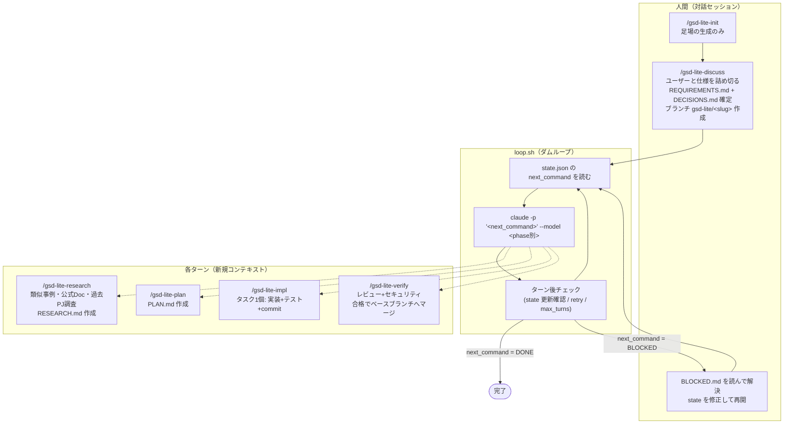

# gsd-lite 設計書 (SPEC)

> Codex 対応追補: 本文の Claude Code 専用コマンド・配置例は従来エンジンの仕様。
> 現行実装は `state.engine`（未指定: `claude`）または `GSD_LITE_ENGINE` で
> `codex` も選択できる。Codex は `codex exec` と `.agents/skills/` を使い、
> `codex.model.<phase>` / `codex.reasoning_effort.<phase>` で設定する。
> discuss 終了時に実行パターンを選択し、`phase_engines.<phase>` でフェーズ別に
> エンジンを上書きできる。`--check` は必要な全フェーズのCLI・スキルを事前検証する。
> 中断・再開追補: `--stop` で `.gsd-lite/logs/.stop` を作成し、ターン境界で
> 終了コード7で一時中断する。通常起動は排他取得後にフラグを削除して保存状態から再開する。
> DONE / BLOCKED を優先し、未コミットstateの復元・リトライ回数の保持は従来と同じ。
> 状態遷移・コミットによる進捗判定・終了コードは両エンジン共通。
> 詳細なインストール・移行・権限設定は [README の Codex 手順](../README.md#codex-で使う) を参照。


- 作成日: 2026-09-09
- ステータス: v0.7 — 進捗監視 3 層（--status / on-phase フック / 監視サブエージェント）を追加
- 参考: [mattpocock/skills](https://github.com/mattpocock/skills) の grilling / grill-with-docs / domain-modeling
- 前提確認済み: `claude -p` はサブスクリプション認証で動作し追加課金なし（実機確認済み）

---

## 1. 背景と目的

gsd-core はワークフロー 33,000 行超・スキル 69 個・4.5MB の重厚なフレームワークであり、
1 マイルストーンの完了までに時間がかかりすぎる。また `gsd-autonomous` のような
セッション内ループはコンテキストが際限なく膨らむ。

**gsd-lite** は次の 2 点を設計の柱とする最小構成の自律開発ランナーである。

1. **コンテキスト制御**: 毎ターン `claude -p` で新規コンテキストを起動し、
   継続性はファイル（`.gsd-lite/`）と git にのみ持たせる（gsd-moonlighting で実証済みのパターン）
2. **最小のフェーズ機構**: ディスカッション（ユーザーとの仕様詰め・対話）→
   リサーチ（類似事例・ドキュメント・過去プロジェクトの調査で要件を強固にする）→
   プランニング → 実装（実装+テスト）→ 検証（レビュー+セキュリティ）の 5 フェーズ。
   gsd-core の UAT / intel / graphify 等は持たない
3. **人間の判断は前倒し**: 仕様の曖昧さは discuss で対話的に潰し切り、
   以降の plan / impl / verify は無人ループで走らせる（gsd-moonlighting の
   「起きている間に議論、寝ている間に実行」と同じ分業）

## 2. スコープ

### 含む（v1）

- 5 フェーズ（discuss / research / plan / impl / verify）のステートマシンと外部ファイルによる状態管理
  - discuss は対話セッションで実行、research 以降は無人ループで実行
- マイルストーンブランチ運用（discuss 完了時に `gsd-lite/<slug>` を作成、verify 合格で
  ローカルのみならベースへ自動マージ、リモートありなら push + MR/PR 作成）
- ダムなループスクリプト `loop.sh`（判断ロジックを持たない）
- 雛形スキル 6 個（init / discuss / research / plan / impl / verify）をプロジェクトローカルに配置
- ブロック時の安全停止（人間へのエスカレーション）
- 検証フェーズからの差し戻しループ（回数上限付き）
- フェーズ別モデルルーティング

### 含まない（v1 では見送り、§10 参照）

- プランニング時のスキル動的生成（v1 はテンプレート方式）
- 複数マイルストーンの並行管理
- gsd-core との相互運用・移行
- 通知の実装（ただしループ終了時のフック点 `on-exit.sh` は v1 に含める。§7 参照）、ダッシュボード

## 3. アーキテクチャ概観



**責務分担の原則**

| コンポーネント | 責務 | 持たないもの |
|---|---|---|
| loop.sh | next_command の実行、暴走・無反応の検知、ログ | フェーズ遷移の判断 |
| state.json | 機械可読な現在状態と「次の一手」 | 長文の文脈 |
| PLAN.md / PROGRESS.md | 次ターンの Claude が読む文脈 | ループが解釈する情報 |
| 各スキル | 1 ターン分の作業手順 + state 更新 | プロジェクト固有の重い情報（PLAN.md 側に置く） |

## 4. ファイルレイアウト

### gsd-lite 本体（配布物）

配置場所は未決（§10）。構成は以下。

```
gsd-lite/
├── bin/
│   └── gsd-lite-loop.sh        # ループ本体（PATH に置くか、init がコピー）
├── templates/
│   ├── skills/                 # プロジェクトへコピーされる雛形スキル
│   │   ├── gsd-lite-discuss/SKILL.md
│   │   ├── gsd-lite-research/SKILL.md
│   │   ├── gsd-lite-plan/SKILL.md
│   │   ├── gsd-lite-impl/SKILL.md
│   │   └── gsd-lite-verify/SKILL.md
│   ├── state.json
│   ├── PLAN.template.md
│   └── settings.allowlist.json # claude -p 用の権限 allowlist 雛形
└── skills/
    └── gsd-lite-init/SKILL.md  # ~/.claude/skills/ に置くグローバルスキル
```

### 対象プロジェクト側（init 後）

```
<project>/
├── .claude/skills/             # 雛形からコピーされたプロジェクトローカルスキル
│   ├── gsd-lite-discuss/
│   ├── gsd-lite-research/
│   ├── gsd-lite-plan/
│   ├── gsd-lite-impl/
│   └── gsd-lite-verify/
├── .claude/settings.json       # allowlist（既存があればマージ）
└── .gsd-lite/
    ├── state.json              # ループが読む機械可読状態
    ├── REQUIREMENTS.md         # discuss で確定した要件（WHAT）
    ├── DECISIONS.md            # discuss で確定した設計判断・却下案とその理由（WHY）
    ├── RESEARCH.md             # research フェーズの成果物（参考実装・盗める設計・落とし穴）
    ├── PLAN.md                 # plan フェーズの成果物（タスク列）
    ├── PROGRESS.md             # 追記専用の申し送りログ
    ├── BLOCKED.md              # ブロック時のみ生成
    ├── archive/<slug>/         # 完了済みマイルストーンの成果物（次の discuss 開始時に退避）
    ├── hooks/on-exit.sh        # 任意。存在すればループ終了時に呼ばれる（通知等はユーザー実装）
    ├── hooks/on-phase.sh       # 任意。フェーズ遷移時に呼ばれる（進捗のプッシュ通知用）
    └── logs/<milestone>/turn-NNN.log  # 各ターンの標準出力（マイルストーン別）
```

`.gsd-lite/` と `.claude/skills/` は **git コミット対象**。リカバリと監査は git log + state で行う。

## 5. state.json スキーマ

```json
{
  "version": 1,
  "milestone": "v1-checkout-feature",
  "phase": "impl",
  "next_command": "/gsd-lite-impl",
  "branch": { "name": "gsd-lite/v1-checkout-feature", "base": "main" },
  "research": {
    "targets": ["similar_oss", "official_docs", "local_projects"],
    "local_search_paths": ["~/workspaces"]
  },
  "turn": 12,
  "max_turns": 60,
  "retry_max": 2,
  "verify_round": 0,
  "verify_round_max": 2,
  "model": {
    "research": "claude-fable-5-1",
    "plan":   "claude-fable-5-1",
    "impl":   "claude-opus-5",
    "verify": "claude-fable-5-1"
  },
  "updated_at": "2026-09-09T10:23:00+09:00"
}
```

- `phase`: `discuss | research | plan | impl | verify | done | blocked`（表示・監査用。ループは見ない）
- `branch`: discuss 完了時に確定。`name` は `gsd-lite/<slug>`（slug = milestone）、
  `base` はブランチ作成時にいたブランチ。verify 合格時のマージ先になる
- `research.targets`: discuss の最終ラウンドで AUQ により選択（デフォルトは 3 つすべて）。
  `similar_oss`（類似 OSS・先行事例の Web 調査）/ `official_docs`（採用技術の公式
  ドキュメント・ベストプラクティス）/ `local_projects`（`local_search_paths` 配下の
  自分の過去プロジェクトから同型実装を探す）
- `next_command`: ループが実行する唯一の値。`/` で始まるスラッシュコマンド文字列のみ実行し、
  それ以外は番兵値として停止する:
  - `DISCUSS`: 対話フェーズが未完了（ループは「先に対話セッションで /gsd-lite-discuss を
    実行せよ」と表示して終了）
  - `DONE`: マイルストーン完了
  - `BLOCKED`: 人間の判断待ち
- `turn`: **各ターンの Claude が終了時に必ずインクリメント**する。loop.sh はこれで
  「ターンが実際に仕事をしたか」を検知する（§7）
- リトライ回数は state に持たない（実行時情報のため）。loop.sh が追跡対象外の
  `logs/.retry` で管理し、ループ自身がターン境界の作業ツリーを汚さないようにする
- タスクの進捗（何番目まで完了か）は state に持たず **PLAN.md のチェックボックスが正**。
  二重管理を避ける

## 6. 各スキル仕様

共通ルール（全スキルの末尾に共通セクションとして記載する）:

- ターン終了時に必ず: (1) `PROGRESS.md` に 3〜5 行追記、(2) `state.json` の
  `next_command` / `phase` / `turn` / `updated_at` を更新、(3) 成果物・PROGRESS・state を
  **まとめて git commit**。**state 更新 → commit の順序が重要** — 逆にすると最終 state が
  未コミットで残り、git からの復元時に完了済みフェーズを再実行してしまう
- 判断に迷う点・要件の曖昧さ・想定外の失敗に遭遇したら **推測せず** `BLOCKED.md` に
  状況と選択肢を書き、`next_command: "BLOCKED"` にしたうえで同様にコミットして終了する

### /gsd-lite-init（グローバルスキル・対話セッションで実行）

足場の生成のみを行う。要件の中身には踏み込まない。

1. `templates/skills/` を `.claude/skills/` へ、allowlist を `.claude/settings.json` へ配置
2. `.gsd-lite/state.json` を生成（`phase: "discuss"` / `next_command: "DISCUSS"`）
3. 初回コミット後、「次は同じセッションで /gsd-lite-discuss」と案内して終了
   （そのまま同一セッションで discuss に続けてよい）
4. **既にセットアップ済みのプロジェクトで再実行された場合は「更新モード」**:
   AUQ で確認のうえ `.claude/skills/gsd-lite-*` と allowlist を最新テンプレートで
   更新する（`.gsd-lite/` には触れない）。gsd-lite 本体の更新を配布済み
   プロジェクトに反映する正規手順はこれ（install.sh はテンプレートまでしか届かない）

### /gsd-lite-discuss（対話セッションで実行・ループからは実行しない）

マイルストーンの仕様をユーザーと**詰め切る**フェーズ。ここが人間の判断を注入する
唯一の定常ポイントであり、以降の無人ループの品質はこのフェーズの網羅性で決まる。

プロトコルは Matt Pocock の **grill-me（grilling スキル）のフロンティア方式**を
AskUserQuestion（AUQ）で実装したもの。原典の「番号付き質問+推奨回答の Markdown」を、
選択式 UI に置き換えてユーザーの回答コストを下げる。

**a-0. 進行中チェック → ブランチ整理 → 退避（この順で）**

0. **進行中チェック（ブランチを動かす前に）**: 現在の state の `phase` が
   `done` / `discuss` 以外なら進行中のマイルストーンがある。checkout も退避もせず
   ユーザーに状況を確認する（先に checkout すると移動先の古い state を見て
   進行中を見逃す）
1. **ブランチ整理**: いま前回の作業ブランチ（`gsd-lite/*`）にいる場合（前回がリモート
   運用で MR 待ちのケース）は state の `branch.base` へ戻る。リモートがあれば
   `git pull --ff-only` で base を最新化し、前回 MR が未マージなら AUQ で
   「待つ / そのまま進める」を確認する
2. **退避**: `.gsd-lite/` に完了済みマイルストーン（`phase: "done"`）の成果物が
   残っていれば、`.gsd-lite/archive/<前回slug>/` へ退避してから開始する
   （state.json は新規作成し直す）

**a. デザインツリーとフロンティア**

- 議論全体を**デザインツリー**として扱う: すべての決定は、その決定に依存する
  子の決定を持つ（例: 「認証方式」が決まって初めて「セッション有効期限」を聞ける）
- **フロンティア** = 前提がすべて確定済みで「今すぐ聞ける」質問の集合。
  ラウンドごとにフロンティア全体を一度に問い、回答を得てツリーを更新し、
  新しく聞けるようになった質問で次のラウンドを組む
- 別の未回答質問に依存する質問は、同じラウンドに**入れない**（後のラウンドへ）

**b. AUQ での 1 ラウンドの組み方**

- フロンティアの質問を AUQ で提示する。1 回の AUQ は最大 4 問なので、
  フロンティアが 4 問を超える場合は影響の大きい順に複数回の AUQ に分割する
  （すべて独立な質問なので同一ラウンド内で連続して聞いてよい）
- 各質問は **2〜4 個の選択肢 + 推奨を先頭に置き「(推奨)」を明記**。
  各選択肢の description にトレードオフを書く。自由入力は AUQ が自動で
  「Other」を出すので選択肢に含めない
- 排他的でない論点（対応したいエッジケース群など）は multiSelect にする
- 質問の観点（初期フロンティアの種）: スコープ境界（やらないこと）/
  受け入れ基準 / 技術選定 / 既存コードとの整合 / エッジケース・異常系の扱い

**c. 事実調査と判断の分離（grilling の原則そのまま）**

- **事実（fact）を調べるのは Claude の仕事**: コードベースの現状・既存の規約・
  ライブラリの有無など、環境から調べられることをユーザーに聞かない。
  必要ならサブエージェントで調査し、調査中でも依存しない質問は先に聞く
- **決定（decision）はユーザーの仕事**: トレードオフのある選択は必ず AUQ で
  ユーザーに委ね、勝手に確定しない

**d. インライン文書化（grill-with-docs のパターン）**

- 決定が確定するたびに、ラウンドの合間に**その場で** `REQUIREMENTS.md`（WHAT:
  要求・受け入れ基準・スコープ外リスト）と `DECISIONS.md`（WHY: 選んだ案 /
  検討して却下した案とその理由。ユーザーが Other で答えた文脈も残す）へ反映する。
  最後にまとめて書かない（セッションが途中で切れても決定が残る）
- 用語の揺れ（同じ概念を複数の語で呼んでいる等）に気づいたら、その場で正準の
  用語を確定し `REQUIREMENTS.md` の用語集セクションに記録する

**e. 終了条件とブランチ作成**

1. フロンティアが空になる（すべての分岐を訪問し、暗黙の仮定が残っていない）まで
   ラウンドを繰り返す
2. 仕上げチェック: 「plan フェーズの Claude が新規コンテキストで REQUIREMENTS.md と
   DECISIONS.md だけを読んで、ユーザーに質問せず計画を立てられるか」を自問し、
   足りなければフロンティアに戻す
3. 最終 AUQ で (a) 確定内容のサマリーへの合意、(b) research の調査対象
   （similar_oss / official_docs / local_projects、multiSelect・デフォルト全選択）を取る
4. **マイルストーンブランチを作成**: base は前回 state の `branch.base`（なければ
   現在のブランチ。前回の作業ブランチ `gsd-lite/*` 上にいる場合は必ず base に戻る）。
   作業ツリーが clean であることを確認し（dirty なら退避方法をユーザーと相談）、
   リモートがあれば `git checkout <base>` → `git pull --ff-only` で base を最新化
   （前回 MR が未マージなら AUQ で「待つ / そのまま進める」を確認）。そのうえで
   `git checkout -b gsd-lite/<slug>` し、base 名を `branch.base` に記録、
   REQUIREMENTS.md / DECISIONS.md / state.json をブランチ上に一括コミットする
5. `phase: "research"` / `next_command: "/gsd-lite-research"` に更新
6. 最後の AUQ で「今すぐループを起動するか」を確認する。
   - **起動する**: discuss セッション自身が `setsid gsd-lite-loop.sh
     > .gsd-lite/logs/loop.log 2>&1 &` でデタッチ起動し、監視コマンド
     （`tail -f` / `jq` での state 確認）を提示して**即座に手を離す**。
     起動後にログをポーリングしない（このセッションのコンテキストが膨らみ、
     毎ターン新規コンテキストにした意味が消える。moonlighting の
     「launcher + monitor に徹する」原則と同じ）
   - **起動する場合はさらに「このセッションで進捗を見守るか」を確認**し、望まれたら
     バックグラウンドの監視サブエージェントを起動する。サブエージェントは自分の
     コンテキスト内で state.json の phase 変化とループ終了を待ち受け、変化時のみ
     1 行要約（例: `research → plan に遷移 (turn 3)`）を親セッションに報告する。
     禁止されるのは「ターン毎のログ全文ポーリング」であり、この粒度の報告は
     マイルストーン全体で数行なので許容される
   - **自分で起動する**: 起動コマンドを提示して終了

### /gsd-lite-research

discuss の決定を**事実で補強する**無人フェーズ。要件を書き換える権限は原則なく、
成果は RESEARCH.md に集約して plan に渡す。

1. `REQUIREMENTS.md` / `DECISIONS.md` を読み、`research.targets` の各対象を調査する:
   - `similar_oss`: 同じ課題を解く既存 OSS・プロダクト・記事を Web 検索。
     「作らなくてよいもの」と「盗める設計」を探す
   - `official_docs`: 採用技術の公式ドキュメント・ベストプラクティス・既知の
     落とし穴を調査し、plan の技術前提を固める
   - `local_projects`: `research.local_search_paths` 配下の自分の過去プロジェクト
     から同型の実装・雛形を探す
2. `RESEARCH.md` に産出: 参考実装（パス/URL 付き）/ 盗める設計 / 使えるライブラリ /
   落とし穴と回避策 / 要件への影響（受け入れ基準に足すべき観点があれば提案として記載）
3. **重大発見の扱い**: discuss の決定を覆しうる発見（例: 要件をほぼ満たす既存 OSS）は
   要旨と選択肢を `BLOCKED.md` に書いて BLOCKED で停止する。「作るか使うか」は
   投資判断なので人間に戻す。覆さない発見は RESEARCH.md に記録して続行
4. commit し、`phase: "plan"` / `next_command: "/gsd-lite-plan"` に更新して終了

### /gsd-lite-plan

1. `REQUIREMENTS.md` / `DECISIONS.md` / `RESEARCH.md` とコードベースを読み、
   `PLAN.md` を作成。RESEARCH.md の参考実装・落とし穴をタスクの設計に反映する。
   仕様の曖昧さを見つけても**ユーザーに聞けない**（無人ターン）ので、discuss の
   決定範囲内で解釈できなければ BLOCKED にする
2. **タスク粒度の品質基準**: 各タスクは「1 ターン（新規コンテキスト 1 回）で
   実装+テスト+コミットまで完結する」大きさを上限とする。手順は 2 段階: ①まず細かく分割して
   洗い出す（漏れ防止）→ ②1 ターンで完結する範囲で同種・同ファイル群を統合する。
   マイルストーン全体で 8〜15 タスクは目安であり、数より 1 ターンで完結することを優先する。
   小規模な要件を 8 タスクに増やす必要はない。15 を超える場合は、分割を維持する理由を
   PLAN.md の「メモ」に記録する。20 を超えたら統合できる箇所を再点検するが、無理に統合しない
3. 各タスクに: 完了基準（テストで機械検証可能な形）/ 対象ファイル / 依存タスク を明記
4. `next_command: "/gsd-lite-impl"` にして終了

PLAN.md のタスク形式:

```markdown
## Tasks
- [ ] T1: ユーザー登録 API のスケルトン
  - 完了基準: POST /users が 201 を返すテストが green
  - 対象: src/routes/users.ts, tests/users.test.ts
  - 依存: なし
```

### /gsd-lite-impl

1. `PLAN.md` の先頭の未完了タスクを **1 つだけ** 選ぶ
2. `PROGRESS.md` の直近の申し送りを読む
3. 実装 → テスト実行 → green を確認 → コミット → チェックボックスを埋める
4. テストが通せない場合は 1 ターン内で最大 2 回まで立て直しを試み、だめなら BLOCKED
5. 未完了タスクが残っていれば `next_command: "/gsd-lite-impl"`（自分自身）、
   全タスク完了なら `next_command: "/gsd-lite-verify"`

### /gsd-lite-verify

1. マイルストーン開始コミット以降の diff 全体を対象に、
   (a) コードレビュー（バグ・設計・テスト妥当性）、(b) セキュリティチェック
   （入力検証・認可・秘密情報・インジェクション等）を実施
2. **合格**: `VERIFICATION.md` に結果を書いてコミットし、**リモートの有無で分岐**する
   （`git remote get-url origin` で判定）:
   - **リモートなし（ローカルのみ）**: ベースブランチへ自動マージ:
     `git checkout <branch.base>` → `git merge --no-ff gsd-lite/<slug>`。
     衝突した場合は `git merge --abort` してマイルストーンブランチに戻り BLOCKED
     （人間が解決）。マージ成功後、ブランチは削除せず残す。
     `phase: "done"` / `next_command: "DONE"` で終了
   - **リモートあり**: ローカルマージはせず `git push -u origin gsd-lite/<slug>` して
     **MR/PR を作成**する（github.com → `gh pr create`、gitlab → `glab mr create`、
     glab 不在時は push オプション `-o merge_request.create -o merge_request.target=...`
     でフォールバック（GitLab サーバー側機能・追加ツール不要）、
     ターゲットは `branch.base`。本文に受け入れ基準の達成状況と VERIFICATION 要約）。
     作成成功で URL を VERIFICATION.md / PROGRESS.md に記録し
     `phase: "done"` / `next_command: "DONE"`（**マージは人間 / CI に委ねる**）。
     **push の成否は毎回確認**し、失敗時は 1 回リトライのうえ DONE にせず BLOCKED を
     追記コミットする（ローカル DONE でもリモート未達を成功にしない）。
     最終 state をコミットして再 push し、**マイルストーンブランチに残ったまま終了する**
     （checkout でベースに移ると作業ツリーの state がベースの古い内容に置き換わり、
     ループが誤動作する。ベースへの復帰は次の discuss の冒頭 0-a が行う: 作業ブランチ上に
     いたら `branch.base` へ戻り、リモートがあれば pull、前回 MR 未マージなら AUQ で確認）。
     CLI 不在・未認証・ホスト不明・push 失敗は状況を BLOCKED.md に書いて BLOCKED
3. **指摘あり**: 修正タスクを `PLAN.md` に `- [ ] F1: ...` 形式で追記し、
   `verify_round` をインクリメント。
   - `verify_round <= verify_round_max` → `next_command: "/gsd-lite-impl"`（差し戻し）
   - 上限超過 → BLOCKED（無限修正ループ防止）

## 7. loop.sh 仕様

```bash
# 擬似コード
cd "$PROJECT_DIR"
while true; do
  cmd=$(jq -r .next_command .gsd-lite/state.json)
  case "$cmd" in
    /*)      : ;;  # スラッシュコマンドのみ実行対象
    DONE)    echo "milestone complete"; exit 0 ;;
    BLOCKED) echo "human input needed: see .gsd-lite/BLOCKED.md"; exit 2 ;;
    DISCUSS) echo "run /gsd-lite-discuss in an interactive session first"; exit 4 ;;
    *)       echo "unknown next_command: $cmd"; exit 5 ;;
  esac

  turn_before=$(jq -r .turn .gsd-lite/state.json)
  phase=$(jq -r .phase .gsd-lite/state.json)
  model=$(jq -r ".model.$phase // empty" .gsd-lite/state.json)

  claude -p "$cmd" ${model:+--model "$model"} \
    --permission-mode acceptEdits \
    > ".gsd-lite/logs/turn-$(printf %03d $((turn_before+1))).log" 2>&1

  # ターン後サニティチェック
  turn_after=$(jq -r .turn .gsd-lite/state.json)
  if [ "$turn_after" -le "$turn_before" ]; then
    retry=$(( $(jq -r .retry .gsd-lite/state.json) + 1 ))
    if [ "$retry" -gt "$(jq -r .retry_max .gsd-lite/state.json)" ]; then
      # 自動 BLOCKED 化（Claude が state を書けずに死んだケースの保険）
      jq '.next_command="BLOCKED" | .phase="blocked"' ... # 略
      exit 2
    fi
    jq ".retry=$retry" ...  # retry を記録してリトライ
    continue
  fi
  jq '.retry=0' ...  # 正常ターンで retry リセット
done
# ※ max_turns はループ先頭・番兵判定の直後に「実行前」判定する（実装参照）。
#   到達済み state からの再起動で 1 ターン余計に実行せず、DONE/BLOCKED が上限より優先される
```

設計上のポイント:

- **判断は一切しない**。`next_command` の実行と、異常検知（turn が進まない /
  max_turns 超過）だけを行う
- turn 番号による生存確認で「`claude -p` が途中クラッシュして state 未更新」を検知し、
  リトライ上限後は自動で BLOCKED に落とす
- **ターンのタイムアウト**: `timeout`（`GSD_LITE_TURN_TIMEOUT` 秒、デフォルト 3600）で
  各ターンを包む。ハングしたターンは kill され「進捗なし」としてリトライ経路に乗る
- **信頼するのはコミット済み state のみ（rc に依らず）**: 進捗判定は常に HEAD の
  state の `turn` で行い、各ターン後に作業ツリーの state を `git checkout HEAD --` で
  正規化する。「state は書いたがコミットしなかった」ターンは rc=0 でも成功扱いしない。
  コミット済みで進捗しつつ rc != 0 の場合（push 等の後処理失敗の可能性）は警告を出して
  続行する — push 中に kill されたケースの残留リスクは WARN ログで許容（§10 #16）。
  ループ自身が書く auto-BLOCKED もコミットする。起動時に state が未コミットなら
  警告（HEAD に state が無い場合は起動拒否）
- **フック・ターンにロック FD を継承させない**: on-exit / on-phase フックと claude の
  起動時に FD 9 を閉じる（フックが残したバックグラウンド子がロックを握り続け、
  停止表示なのに再起動拒否になる事故を防ぐ）
- **依存チェック**: 起動前に `jq` / `timeout` / `flock` / claude バイナリの存在を確認し、
  欠けていれば終了コード 6 で即停止する（誤った理由での BLOCKED を防ぐ）
- 全ターンの標準出力を **`logs/<milestone>/`** に保存（マイルストーン別に分け、
  turn 初期化後の次マイルストーンによる上書きを防ぐ）
- 終了コードで状態を表現: 0=完了 / 2=要人間(BLOCKED) / 3=max_turns / 4=discuss未完了
- **ネスト起動対応**: loop.sh は Claude Code セッション内の Bash からも起動される
  （discuss が自分でデタッチ起動するケース）。そのため:
  - `claude -p` の呼び出し時に親セッション由来の環境変数を除去する
    （`env -u CLAUDECODE -u CLAUDE_CODE_ENTRYPOINT claude -p ...`）
  - 先頭で二重起動ガード: **`flock`**（`logs/.lock`）による排他。ロックはプロセス終了で
    自動解放されるため stale 処理も競合窓も存在しない。`loop.pid` は --status 表示用の
    情報ファイルに格下げ。起動元セッションを閉じてもループは生き続ける（setsid でデタッチ済み）
- **終了フック**: いかなる理由でも終了する直前に、`.gsd-lite/hooks/on-exit.sh` が存在し
  実行可能なら `on-exit.sh <exit_code> <phase>` として呼ぶ。通知（ntfy / desktop 等）は
  ユーザーがこのフックに任意実装する。フックの失敗はループの終了コードに影響させない
- **フェーズ遷移フック**: 各ターン後に phase の変化を検知したら、
  `hooks/on-phase.sh <旧phase> <新phase>` が存在すれば呼ぶ（プッシュ通知用。
  失敗は無視）。loop.sh は毎周 state を読んでいるので追加コストはない
- **--status サブコマンド**: `gsd-lite-loop.sh --status` で phase / turn / 実行中タスク
  （PLAN.md の先頭未完了）/ PROGRESS.md の直近数行 / 直近コミットを整形表示して即終了。
  トークンを消費しない人間用の覗き窓。ループとは独立にいつでも実行できる

## 8. 権限・実行前提

- `claude -p` は権限プロンプトに応答できないため、**allowlist の事前整備が前提**。
  init がテンプレートの allowlist（git / テストランナー / パッケージマネージャ等の
  定型コマンド）を `.claude/settings.json` に配置する
- 基本は `--permission-mode acceptEdits` + allowlist。それでも止まる場合のみ、
  隔離環境（worktree / コンテナ）での `--dangerously-skip-permissions` を検討する
- 既存の `/fewer-permission-prompts` スキルで対象プロジェクトの allowlist を
  育てる運用と相性が良い
- research フェーズは無人ターンで Web 検索を行うため、allowlist テンプレートに
  WebSearch / WebFetch の許可を含める。`local_projects` 調査は
  `research.local_search_paths` 配下の読み取り許可が必要
- **git 識別は必須**。ループ（auto-BLOCKED）も各ターンも state.json をコミットする
  契約なので、`user.name` / `user.email` が無いと全ターンが無進捗扱いになる。
  `--check` と通常起動は `git var GIT_COMMITTER_IDENT` で事前検証し、未設定なら
  終了コード 6 で止める
- **Codex sandbox は値の妥当性だけでなく実効性を検証する**。bubblewrap が
  unprivileged user namespace を作れない環境では workspace-write sandbox 下の
  シェル実行・apply_patch が全て失敗する（値は妥当なので `--check` を素通りし、
  最初の Codex ターンが 3 回無進捗で auto-BLOCKED になる）。Codex を使うフェーズが
  あり sandbox が `danger-full-access` 以外なら `codex sandbox -c sandbox_mode=... -- true`
  を起動前に実行し、失敗時は対処（`GSD_LITE_CODEX_SANDBOX=danger-full-access` /
  カーネル設定 / Claude への切り替え）を示して終了コード 6。
  `GSD_LITE_CODEX_SANDBOX_PROBE=skip` で省略可、`codex sandbox` 非対応の旧版は WARN のみ
- 無人ターンでは MCP ツールの承認プロンプトに応答できない。Codex 側で
  `approval_mode = "approve"` を要求する MCP ツール（書き込み系）は
  `approval_policy=never` により常に拒否されるので、無人実行に使う MCP は
  承認不要に設定しておく（gsd-lite の範囲外だが典型的な無進捗要因）

## 9. ブロック・再開プロトコル

1. ターン内の Claude が `BLOCKED.md` に「状況 / 質問 / 選択肢と推奨」を書く
2. `next_command: "BLOCKED"` → loop.sh が exit 2 で停止
3. 人間が対話セッションで `BLOCKED.md` を確認し、判断を `REQUIREMENTS.md` なり
   `PLAN.md` なりに反映（この作業自体を補助する `/gsd-lite-resume` は v2 候補）
4. `next_command` を適切なフェーズコマンドに書き戻し、**変更を必ずコミットしてから**
   loop.sh を再起動する（ループはコミット済み state を正とするため、未コミットの
   再開編集は最初のターン失敗時に HEAD へ巻き戻される）

## 10. 決定事項ログ（2026-09-09 ユーザーレビューで確定）

| # | 論点 | 決定 |
|---|---|---|
| 1 | 本体の配置 | **独立リポジトリ** `~/workspaces/gsd-lite`。install スクリプトで `~/.claude/skills/` に init スキルを配置 |
| 2 | スキル動的生成 | **テンプレート式**。生成の自由度が必要になった時点で v2 で導入 |
| 3 | verify の実装 | **1 ターンで review+security**。diff が大きく溢れるようなら v2 で分割 |
| 4 | plan の承認ゲート | **なし（完全自動）**。仕様は discuss で確定済み、疑義があれば plan 自身が BLOCKED で停止 |
| 5 | 通知 | **フック点のみ用意**（`hooks/on-exit.sh`）。通知の中身はユーザー任意実装 |
| 6 | discuss の深さ | **grilling のフロンティア方式を AUQ で実装**（§6）。フロンティアが空になるまで詰め切る |
| 7 | ブランチ運用 | **discuss 完了時に `gsd-lite/<slug>` を作成**（slug = milestone、要件類はブランチに一括コミット）。init のコミット（スキル・allowlist）はベースブランチに残る |
| 8 | ループの実行場所 | **同一作業ツリー**（ループ実行中はリポジトリを触らない運用）。worktree 分離は v2 候補 |
| 9 | DONE 時の処理 | ~~ローカル自動マージのみ~~ → **2026-09-09 改訂: リモートの有無で分岐**。ローカルのみ: ベースへ --no-ff 自動マージ（衝突は BLOCKED）/ リモートあり: push + MR/PR 作成して DONE（マージは人間・CI）。ブランチは残す |
| 10 | research フェーズ | **discuss と plan の間に独立フェーズとして新設**（無人ループ内）。重大発見（作るか使うかの判断を要するもの）は BLOCKED で人間に戻す |
| 11 | research の調査対象 | **similar_oss / official_docs / local_projects の 3 種をマイルストーンごとに選択可能**（discuss 最終ラウンドの AUQ、デフォルト全選択） |
| 12 | ループの起動方法 | **discuss セッション自身が setsid でデタッチ起動するのを標準 UX に**（AUQ で確認、手動起動も可）。起動後はポーリングせず手を離す。loop.sh は env -u によるネスト対策と loop.pid の二重起動ガードを持つ |
| 13 | 進捗監視 | **3 層すべて v1 に入れる**: `--status` サブコマンド（プル・トークンゼロ）/ `on-phase` フック（プッシュ通知）/ 監視サブエージェント（セッション内、フェーズ変化時のみ 1 行報告）。禁止されるのはターン毎のログ全文ポーリングのみ |
| 14 | Codex 敵対的レビュー反映（2026-09-09） | **7 件の指摘をすべて修正**: state 更新→commit の順序統一 / リモート運用の base 汚染防止（verify の base 復帰 + discuss の base pull と MR 未マージ確認）/ allowlist に push・gh・glab 追加 / max_turns の実行前判定 / ターンの timeout / pid の原子的取得 / マイルストーン別ログ |
| 15 | Codex 敵対的レビュー第 2 ラウンド反映（2026-09-09） | **回帰 2 件を含む 7 件を修正**: verify の base 復帰を撤回（復帰は次回 discuss 冒頭 0-a へ移動）/「信頼するのはコミット済み state のみ」原則（rc!=0 は HEAD から復元して判定）/ 排他を flock に置換 / retry を追跡対象外 logs/.retry へ分離 / discuss の遷移をコミットに内包 / init に既存プロジェクト更新モード / timeout・flock の依存チェック。テストはコミットする実 git スタブに刷新（27 assert） |
| 16 | Codex 敵対的レビュー第 3 ラウンド反映（2026-09-09） | **5 件を修正**: 進捗判定を rc 非依存の「コミット済み state のみ」に強化（rc=0 の未コミット DONE も不採用、毎ターン境界で state を HEAD に正規化、auto-BLOCKED もコミット）/ verify は push 成否を確認し失敗なら BLOCKED を追記コミット（push 中 kill の残留リスクは WARN で許容と明記）/ discuss は checkout 前に進行中チェック / フック・ターンにロック FD (9) を継承させない / 再開手順に「コミットしてから再起動」を必須化。テスト 30 assert |

## 11. 利用手順（ユーザー視点のウォークスルー）

### 初回のみ: gsd-lite のインストール

```bash
git clone <gsd-lite-repo> ~/workspaces/gsd-lite
~/workspaces/gsd-lite/install.sh
# → gsd-lite-loop.sh を ~/.local/bin/ へ、gsd-lite-init を ~/.claude/skills/ へ配置
```

### 1. プロジェクトのセットアップ（プロジェクトごとに 1 回・対話）

```bash
cd ~/projects/myapp
claude
```

```
> /gsd-lite-init
```

→ `.claude/skills/`（discuss〜verify の 5 スキル）と allowlist、`.gsd-lite/` の足場が
生成され、ベースブランチにコミットされる。

### 2. 仕様詰め（マイルストーンごと・対話）

同じセッションのまま:

```
> /gsd-lite-discuss 決済機能を追加したい
```

→ AUQ のラウンドが始まる。ユーザーは選択肢を選んでいくだけ（自由記述は Other）。
フロンティアが空になると、最終 AUQ でサマリー合意 + research 対象選択 →
ブランチ `gsd-lite/<slug>` が作られ要件がコミットされ、**ループ起動コマンドが提示される**。
ここまでがユーザーの「働く」時間。

### 3. 無人ループ実行（放置・夜間可）

discuss の最後に「今すぐ起動するか」を聞かれるので、**そのまま「はい」と答えれば
discuss セッション自身がデタッチ起動してくれる**（コピペ不要・セッションは閉じてよい）。
自分で起動する場合は:

```bash
setsid gsd-lite-loop.sh > .gsd-lite/logs/loop.log 2>&1 &
```

→ research → plan → impl ×N → verify → 自動マージ → DONE が無人で進む。
実行中はこのリポジトリを触らない（同一ツリー運用）。

**進捗の見方**（3 層、好みで併用可）:

- **プル型（トークンゼロ）**: 別ターミナルからいつでも

  ```bash
  gsd-lite-loop.sh --status
  ```

- **プッシュ型**: `hooks/on-phase.sh` に ntfy 等を書いておけばフェーズ遷移が通知される
- **セッション内**: 起動時に「進捗を見守るか」と聞かれるので「はい」と答えると、
  監視サブエージェントがフェーズ変化・終了時だけ 1 行報告してくれる
  （discuss セッションを開いたままにしておく人向け）

生ログが必要なときだけ `tail -f .gsd-lite/logs/loop.log`。

### 4. 終了時の対応（exit code で分岐）

| exit | 意味 | ユーザーがやること |
|---|---|---|
| 0 | DONE | ローカルのみ: ベースブランチにマージ済み / リモートあり: MR/PR 作成済み（URL は `VERIFICATION.md`）。成果を確認して終わり |
| 2 | BLOCKED | `BLOCKED.md` を読む → 対話セッションで判断を REQUIREMENTS/PLAN に反映 → `next_command` を戻す → **コミットしてから** loop.sh 再実行 |
| 3 | max_turns | 進捗と PLAN を確認し、必要なら max_turns を増やして再実行 |
| 4 | discuss 未完了 | 対話セッションで /gsd-lite-discuss を先に実行 |

通知が欲しければ `.gsd-lite/hooks/on-exit.sh` に ntfy 等を書いておく。

### 5. 次のマイルストーン

再び手順 2 から（init は不要）。discuss が前回の成果物を `archive/<slug>/` に
退避してから新しいマイルストーンを開始する。

### 6. 追加タスクの扱い（FAQ）

- **次の機能を足したい** → 新しいマイルストーンとして手順 2 から。
  「1 機能 = 1 マイルストーン」が推奨形（verify は REQUIREMENTS の受け入れ基準に
  対して合否を判定するため、機能単位で要件を切るほど判定が正確になる）
- **走行中のマイルストーンに途中でタスクを足したい** →
  1. `kill $(cat .gsd-lite/loop.pid)` で停止する。bash の仕様でシグナル処理は
     実行中のターン終了後になるため、**現在のターンは完走してから**止まる
     （ターン境界は常にコミット済みで一貫している）
  2. REQUIREMENTS.md に要件・受け入れ基準を追記し、PLAN.md の Tasks 末尾に
     タスクを追記してコミット（**タスクだけ足すと verify の判定対象から外れる**
     ので必ずセットで）
  3. ループを再起動
- ループ実行中のリポジトリ編集は不可（同一ツリー運用の原則）。上記の停止を挟むこと

## 12. 実装ステップ（設計承認後）

1. `~/workspaces/gsd-lite` リポジトリ作成、`loop.sh` 実装（モック state での動作確認）
2. 雛形スキル 6 個の作成
3. トイプロジェクトで E2E ドライラン（discuss → research → plan → impl ×N → verify →
   自動マージ → DONE の一巡）
4. BLOCKED 経路・差し戻し経路の動作確認
5. 実プロジェクトで小さいマイルストーンを 1 本流して評価
