<!--
🎨 図の生成ガイド（この記事の図はすべて個別に画像生成する。各図の直前にある「🎨 FIG-NN」コメントのプロンプトを使う）

■ 全図共通のスタイル（各図のプロンプトの先頭にこの STYLE を付けて生成する）
STYLE: Flat vector infographic for a friendly Japanese tech blog. White background, generous whitespace,
rounded rectangles and circles, thin clean outlines, no gradients, no 3D, no photorealism, no drop-shadow clutter.
Palette: deep navy #1E2761 (main shapes, headings), mint green #02C39A (accents, arrows, highlights),
pale blue #EFF4FD (cards), soft gray #5A6478 (secondary text), small touches of warm yellow #FFD166 for sparkles only.
Mood: pop and cheerful but tidy. Small cute robot characters (round head, antenna, simple face) and a crescent moon
motif may appear as mascots. Render every Japanese label EXACTLY as quoted, in a clean sans-serif (Noto Sans JP style),
keep labels short, and do not add any other text. Default aspect ratio 16:9 (1600x900) unless noted.

■ 出力先: docs/images/blog-v2/figNN-*.png（記事中の画像リンクと同じファイル名）
■ 図の一覧（03 は削除して欠番。ファイル名は生成済み画像に合わせて番号を詰めない）: 01 全体マップ / 02 マルチエンジン / 04 6 フェーズ / 05 PMI 振り返り /
  06 記録の強化 / 07 サブエージェント並列 / 08 運用ツール / 09 V2 実録の数字 / 10 チームでの衝突 /
  11 target.path / 12 2 つの git / 13 V2.5 実録の数字 / 14 trust 事件 / 15 次の構想
-->

# 🌙 続・仕様を詰めたら、あとは寝るだけ。gsd-lite は「3 つの AI」と「振り返り」と「チーム開発」を覚えました

こんにちは！前回の記事「[🌙 仕様を詰めたら、あとは寝るだけ。自律開発ランナー「gsd-lite」を作った話](blog.md)」では、対話で仕様を詰め切ったら無人ループが research → plan → impl → verify まで走り切る、という小さな仕組みをご紹介しました。

あれから 2 週間ちょっと。実際に何本もマイルストーンを流してみたところ、「ここ、もっとこうしたい！」がたくさん出てきました 😆 そこで今回は、そのぶんを詰め込んだ **V2** と、チーム開発に向けた **V2.5（gsd-control）** のお話です。

`3 エンジン` / `reflect（振り返り）` / `並列化` / `運用ツール` / `制御リポジトリ` / `実録 2 本`

<!-- 🎨 FIG-01 | file: images/blog-v2/fig01-overview.jpg | 16:9
PROMPT: A friendly overview map. In the center, a navy rounded badge labeled "gsd-lite" with a small crescent moon,
and underneath it three small unchanged pillars labeled "新品のコンテキスト", "何も考えないループ", "潔く止まる".
Around the center, six mint-outlined bubbles connected by thin lines, each with a simple icon:
"3 エンジン" (three small robot heads), "フェーズ別モデル" (a speedometer-like dial), "reflect" (a mirror),
"記録の強化" (a notebook and stopwatch), "並列化" (three parallel arrows), "運用ツール" (a toolbox).
A seventh, larger bubble on the right filled with mint green labeled "V2.5 gsd-control" with an icon of two linked folders.
Small label at top-left "V1 → V2 → V2.5". Cheerful sparkles around the V2.5 bubble.
-->
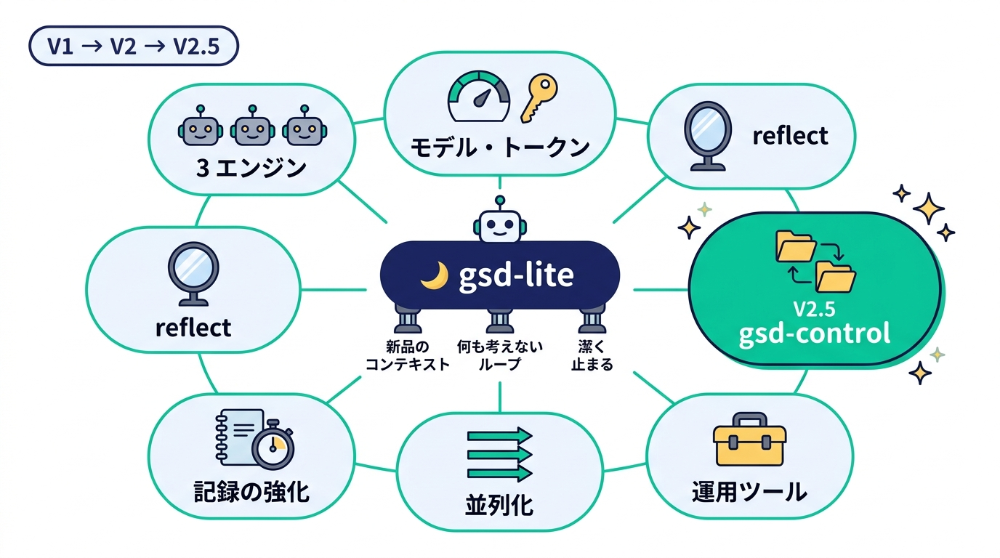

## 🧭 この記事でわかること

変わっていないものから先にお伝えしますね。前回の 3 原則「**毎ターン新品のコンテキスト**」「**何も考えないループ**」「**迷ったら潔く止まる**」は、そのままです ✋ 今回増えたのは、その周りの 7 つです。

1. 🤹 **3 つの AI を適材適所に**（Claude Code / Codex / OpenCode をフェーズごとに選べる）
2. 🎛️ **フェーズ別モデル**（計画とレビューは賢く、実装はコスパ重視で）
3. 🪞 **reflect フェーズ**（完了後に、記録だけを根拠に振り返る）
4. 📝 **記録の強化**（振り返りの材料をちゃんと残す）
5. 🐙 **サブエージェントで並列に実装・レビュー**
6. 🛠️ **運用ツール**（起動前に止める・途中で止める・眺める）
7. 🏢 **gsd-control**（V2.5。状態と成果物を別リポジトリに置いて、チームで使えるように）

それぞれに「実際に走らせてみたらどうだったか」の実録もつけています。どうぞお付き合いください 🙏

## 🤹 V2 その 1：3 つの AI を、フェーズごとに使い分ける

前回の gsd-lite は Claude Code 専用でした。V2 では **Claude Code・Codex・OpenCode** の 3 つを実行エンジンとして使えるようになりました 🎉

ポイントは「**対話するホストと、無人ループのエンジンは別物**」ということです。たとえば、仕様を詰める discuss は使い慣れた Claude Code で行い、実装だけ Codex に、レビューだけまた別のエンジンに……といった分担ができます。

<!-- 🎨 FIG-02 | file: images/blog-v2/fig02-engines.jpg | 16:9
PROMPT: A horizontal pipeline of five rounded cards left to right labeled "research", "plan", "impl", "verify", "reflect",
connected by mint arrows. Above each card sits a small robot mascot wearing a badge with its engine name:
research="Claude", plan="Claude", impl="Codex", verify="OpenCode", reflect="Claude" (each robot a slightly different
color shade of navy, green, gray so they are distinguishable). On the left, a separate speech-bubble area labeled
"discuss（対話）" with a human silhouette chatting with a robot badge "Claude". Along the bottom, a small priority
ladder with three steps from strongest to weakest: "GSD_LITE_ENGINE" → "phase_engines" → "engine".
-->
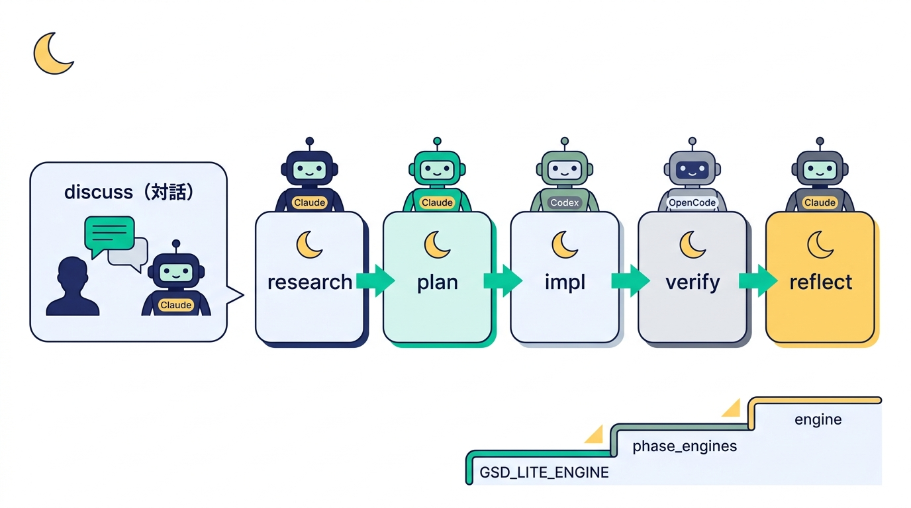

| エンジン | 無人ターンの起動 | プロジェクト内のスキル置き場 |
|---|---|---|
| 🟣 Claude Code | `claude -p`（allowlist + acceptEdits） | `.claude/skills/` |
| 🟢 Codex | `codex exec`（workspace-write sandbox・承認なし） | `.agents/skills/` |
| 🔵 OpenCode | `opencode run`（deny 以外は自動承認） | `.opencode/skills/` |

どのエンジンで走らせるかは、discuss の最後に「実行パターン」として選びます。「すべて Claude」「実装だけ Codex」「レビューだけ Codex」「実装だけ OpenCode」「カスタム」……と選ぶだけで、state.json に保存されます 📌

state の `next_command` は `/gsd-lite-impl` のようなエンジン共通の書き方のままで、ループが各エンジン向けの呼び方（Codex ならスキル参照、OpenCode なら「このスキルを読み込んで 1 ターン実行して」）に変換してくれます。スキル本体も 1 セットで 3 エンジン共通です 🙌

> 🐧 **ちょっとした落とし穴：Ubuntu 24.04 と Codex の sandbox**
> Codex の Linux sandbox は bubblewrap が一般ユーザーで user namespace を作れることを前提にしています。Ubuntu 24.04 以降は AppArmor の既定でこれが禁止されていて、そのままだと **Codex のターンが何も書けずに終わる** んです 😱 V2 では、起動前の検証（後述の `--check`）で実際に `codex sandbox -- true` を叩いて確かめ、ダメなら対処法つきで止まるようにしました。

## 🎛️ V2 その 2：フェーズ別モデル

「計画とレビューは賢いモデルで、実装はコスパ重視で」——これも state.json に書いておくだけで実現できます。モデル名は各エンジンの流儀で書けて、Codex なら推論強度、OpenCode ならバリアントやエージェントも指定できます。init のあとでも、ループを止めて state.json を編集・コミットすればいつでも変えられます ✍️

## 🪞 V2 その 3：reflect —— 振り返りまでが開発です

V2 でいちばん気に入っている機能がこれです ✨ verify に合格してマージ（または MR 作成）が済んだあと、**reflect フェーズが 1 ターンだけ走って、振り返りを書いてから DONE になります**。

<!-- 🎨 FIG-04 | file: images/blog-v2/fig04-six-phases.jpg | 16:9
PROMPT: A horizontal flow of seven rounded pills left to right: "discuss" (navy, with a small human icon),
"research", "plan", "impl ×N", "verify", "reflect", "DONE". The "reflect" pill is filled mint green with a small mirror
icon and a tiny yellow "NEW" tag. Under "discuss" a caption "対話", under research..reflect a bracket caption
"ここから無人". A long curved dashed mint arrow goes from "reflect" back to "discuss" and "plan" of a faded next
row labeled "次のマイルストーン", with the arrow labeled "次回への提案". Clean and cheerful.
-->
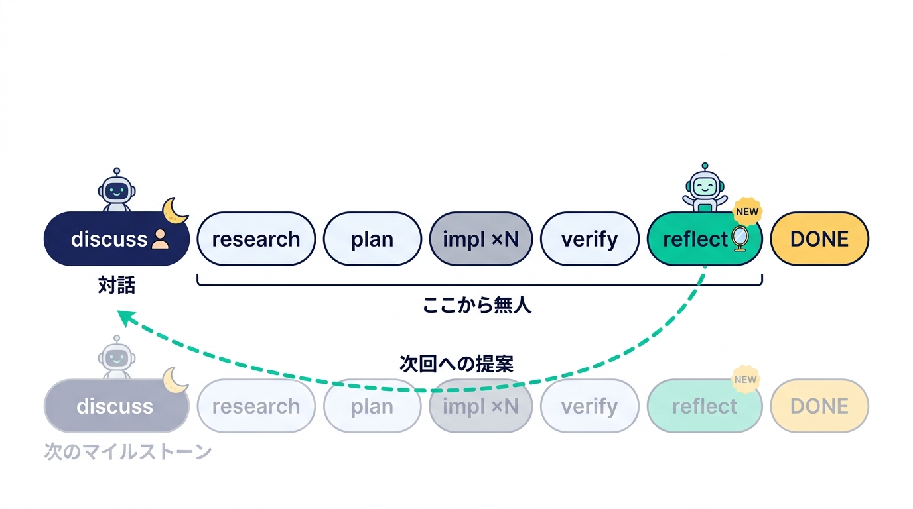

ここで大事なのは、**reflect のターンも新品のコンテキストで動く**ということです。つまり、作業の記憶はまったく持っていません 🙈 あるのは記録だけ。なので reflect には「記録から言えることだけを書く」「推測なら『推測:』と明記する」「Minus と Interesting には必ず根拠（ターン番号・コミット・ファイル）を添える」というルールを課しています。

書く形式は **PMI**（Plus / Minus / Interesting）＋「次回への提案」です。

<!-- 🎨 FIG-05 | file: images/blog-v2/fig05-pmi.jpg | 16:9
PROMPT: A cute robot detective with a magnifying glass sits in the center reading documents. On the left, four input
cards flowing toward it with arrows: "PROGRESS.md", "turns.jsonl", "git log", "VERIFICATION.md".
On the right, an output note card divided into three colored columns with big symbols: "Plus ＋" (mint),
"Minus −" (navy), "Interesting ！" (gray), and below it a checklist strip labeled "次回への提案" with three empty
checkboxes. A small tag on the note card reads "根拠つき". 16:9.
-->
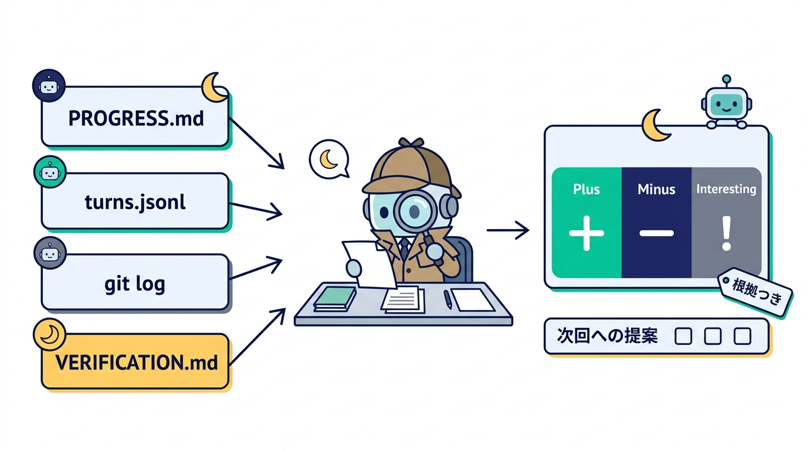

そして「次回への提案」は、**次のマイルストーンの plan と discuss が必ず読みます** 📖 反映した提案・しなかった提案は理由つきで PLAN.md や DECISIONS.md に残り、次の reflect が「前回の提案は守られたか？」をチェックします。振り返りが書きっぱなしにならない、小さな改善ループの完成です 🔁

### 🔧 おまけ：修正ラウンド（MR の指摘もループで直す）

リモート運用で MR を作ったあと、レビューで指摘をもらうこともありますよね。そんなときはマイルストーンのブランチにいる状態で `/gsd-lite-discuss <指摘内容>` を実行して「修正ラウンド」を選ぶだけ。同じブランチに留まって、plan が修正タスクを `F1-1`, `F1-2`… と追記し、impl が直し、verify は既存の MR に push するだけ。最後に reflect が「**なぜ最初の verify で見つからなかったのか**」を残してくれます 🕵️

## 📝 V2 その 4：記録の強化 —— 振り返りは、記録の質で決まる

reflect に記憶がない以上、振り返りの質は記録の質で決まります。そこで記録を 2 つ強化しました。

<!-- 🎨 FIG-06 | file: images/blog-v2/fig06-records.jpg | 16:9
PROMPT: Two side-by-side illustrations feeding into a funnel on the right that pours into a small mirror icon labeled
"reflect". Left: an open notebook labeled "PROGRESS.md" whose page shows four short labeled lines: "やったこと",
"想定外", "やり直し", "次への注意". Middle: a stopwatch next to a stack of thin horizontal data strips labeled
"turns.jsonl" with tiny tags on the strips: "phase", "所要秒", "rc", "commits". Caption under the notebook:
"各ターンの小さな振り返り", caption under the stopwatch: "ループが自動で計測". 16:9, cheerful.
-->
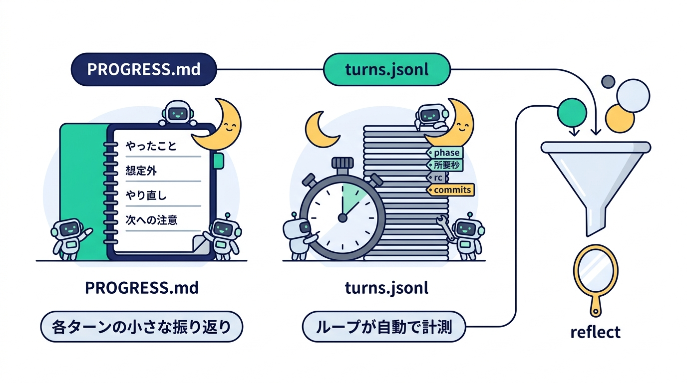

**① PROGRESS.md の申し送りを固定項目に** ✍️
全フェーズ共通で「やったこと / 想定外 / やり直し / 次への注意」の 4 項目を必ず書きます。想定外がなければ「なし」、やり直しがなければ「0 回」。しかも「やり直しの原因が次のターンでも起こりそうなら、次への注意にも転記する」というルールつきです。各ターンが自分の小さな振り返りを残し、reflect がそれを集約するイメージですね。

**② ループが turns.jsonl に計測値を記録** ⏱️
ループ自身が、1 試行ごとにフェーズ・エンジン・モデル・試行回数・所要秒・終了コード・進捗の有無・増えたコミット数を 1 行ずつ追記します。こちらはトークンを 1 つも使わない客観データで、失敗した試行もリトライもそのまま残ります。`jq` でフェーズ別の所要時間やリトライの集中がすぐ集計できます 📊

## 🐙 V2 その 5：サブエージェントで並列に実装・レビュー

Claude Code の Agent ツールや OpenCode の task ツールのように、エンジンがサブエージェントを使える場合は、1 ターンの中で作業を並列化できるようにしました（`subagents: auto` が既定）。

<!-- 🎨 FIG-07 | file: images/blog-v2/fig07-subagents.jpg | 16:9
PROMPT: A bigger parent robot (navy) at the top holding a clipboard labeled "タスク T2". Three small helper robots
(mint) below it, each at its own desk with a separate file card: "A: モデル層", "B: API 層", "C: テスト".
Dotted arrows from each helper back up to the parent labeled "報告". Next to the parent, a green check stamp labeled
"テスト → コミットは親だけ". At the bottom, a small red-outlined "no entry" sign listing crossed-out items:
"git commit", "state.json", "PLAN.md", "PROGRESS.md" with the caption "サブエージェントは触らない". 16:9, cute.
-->
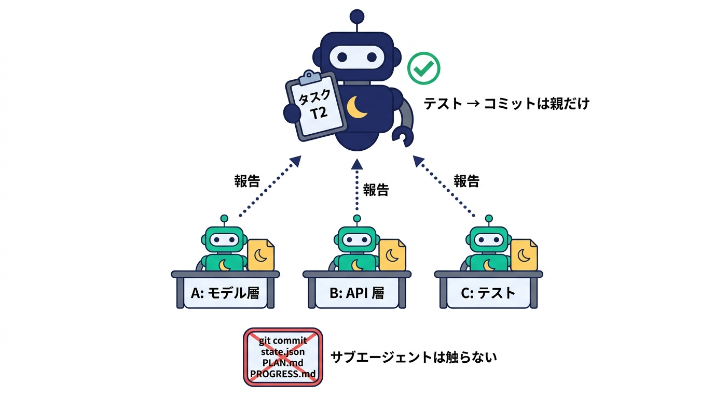

- 📋 **plan** が、各タスクに「並列サブ作業」（対象ファイルが重ならない独立した単位）を書きます
- 💻 **impl** は、サブ作業が 2 つ以上あればサブ作業ごとにサブエージェントを起動して並行実装。親がまとめてテストしてコミットします
- 🛡️ **verify** は、コードレビューとセキュリティチェックを別々のサブエージェントに読み取り専用で並行させます

守られる約束はひとつだけ。**サブエージェントは git commit・state.json・PLAN.md・PROGRESS.md に触らない**。だから「コミット済みの state だけを信頼する」という gsd-lite の大原則は、並列化しても崩れません 🧱

> 😅 **実際にあったこと**
> 並列実装のサブエージェントが、頼んでいない「保険」の処理（型の継承やフォールバック）を気を利かせて足してしまい、統合時に衝突したことがありました。いまは依頼文に「契約にない挙動は実装せず、提案として報告だけする」という固定文言を必ず入れています。

## 🛠️ V2 その 6：運用ツール —— 起動前に止める、途中で止める、眺める

地味ですが、毎日使うのはこのあたりです。ぜんぶ bash と jq だけで動きます。

<!-- 🎨 FIG-08 | file: images/blog-v2/fig08-ops-tools.jpg | 16:9
PROMPT: Three equal panels side by side, each a rounded card with a big icon on top.
Panel 1 "--check": a shield with a checklist showing four ticked lines "CLI", "スキル", "git 識別", "sandbox".
Panel 2 "--stop": a pause button between two turn blocks labeled "ターン N" and "ターン N+1" with a small caption
"ターンの切れ目で止まる". Panel 3 "--watch": a small dark terminal window mock (navy) showing a few mint text lines
"phase : impl", "turn : 7/60", "- [ ] T4", with a tiny caption "q で終了 / s で中断". 16:9, clean and friendly.
-->
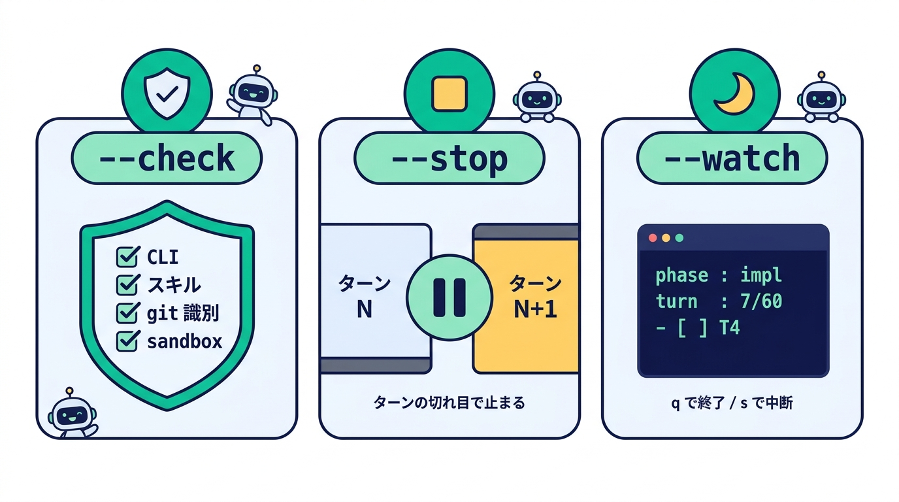

- ✅ **`--check`（事前検証）**：全フェーズの CLI とスキルの配置、git のコミット者設定、Codex sandbox の実効性を、**最初のターンより前に**確かめます。後半で使う CLI が足りないのに気づかず、夜中に途中で止まる……を防げます
- ⏸️ **`--stop`（中断と再開）**：実行中のターンはコミットまでやり切らせて、次を始める前に止まります（終了コード 7）。再開は同じコマンドを叩くだけ
- 👀 **`--watch`（簡易 TUI）**：状態・フェーズごとのエンジンとモデル・PLAN のタスク・実行中ターンのログ末尾を、数秒ごとに再描画。`q` で終了、`s` で中断依頼。読むだけなのでトークンはゼロです

ちなみに「git の `user.name` / `user.email` が未設定だと、全ターンが無進捗で止まる」という罠も `--check` で拾うようにしました。ループも各ターンも state.json をコミットする契約なので、ここが無いと何も進まないんです 🫠

## 🌃 実録その 1：TODO CLI を V2 のフルサイクルで完走

V2 の機能をぜんぶ入りで走らせた記録です（2026-09-25、simple-todo-cli）。discuss のあと、research → plan → impl ×14 → verify ×3 → ローカルマージ → reflect → DONE まで無人で進みました。

<!-- 🎨 FIG-09 | file: images/blog-v2/fig09-v2-results.jpg | 16:9
PROMPT: A dark navy background dashboard. Top row: four rounded stat tiles with big mint numbers and small light
labels: "20" "無人ターン", "0" "リトライ / BLOCKED", "317" "テスト green", "82 分" "討議後の総所要".
Bottom-left: a horizontal bar chart in mint with labels and values: "research 8.2", "plan 3.8", "impl ×14 50.2",
"verify ×3 20.2", "reflect 4.5" (minutes). Bottom-right: a small moon and a sleeping robot with "zzz". 16:9.
-->
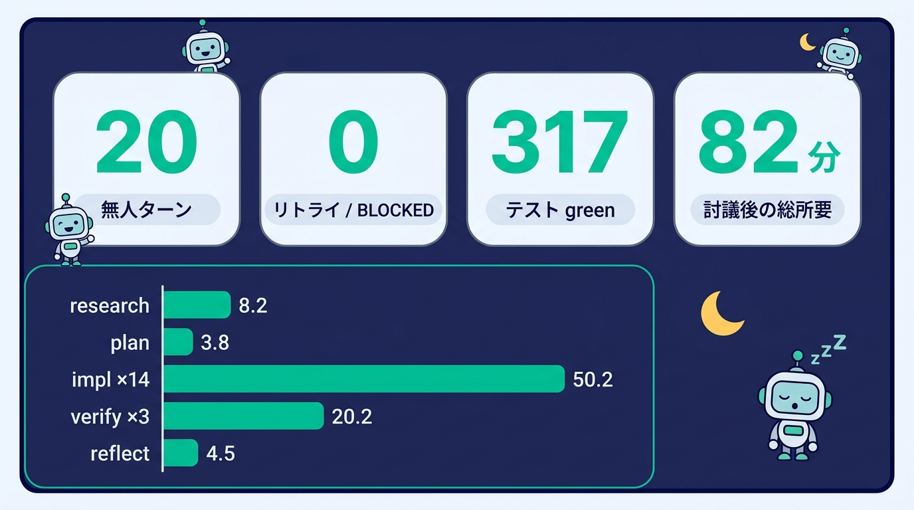

| 項目 | 値 |
|---|---|
| 🤖 無人ターン | 20 |
| 🔁 リトライ / BLOCKED | 0 |
| ✅ テスト | 317 件 green |
| ⏱️ 討議後の総所要 | 82 分 |

面白かったのは、**reflect が出した指摘が、そのまま gsd-lite 本体の改善につながった**ことです 🤩 たとえば——

- 🔍 verify が 3 ラウンドかかり、2 ラウンド目の指摘が 1 ラウンド目と同じ型だった → 「入力クラスの境界は一括で洗う」観点を verify に追加
- 🤝 並列実装のサブエージェントが「保険」を足して衝突 → 依頼文に固定文言
- 🔂 同じ lint エラーで 2 ターン連続やり直し → 「次への注意」への転記ルール
- 🌱 まだコミットの無い main から分岐して verify が場当たり対応 → discuss で base を確認

計画 5 タスクに対して、verify 起因の修正タスクが 9 つ。ただし受け入れ基準を満たさなかったものは 0 件で、指摘はすべて要件の外側（異常系やテストの穴）でした。「要件どおりに作る」は十分できていて、伸びしろは「どこまで堅牢にするかを先に決めておくこと」だな、というのが学びです 📚

## 🏢 V2.5：gsd-control —— 状態と成果物を、別のリポジトリへ

さて、ここからが V2.5 です！ 🎊

gsd-lite を使っていると、どうしても `.gsd-lite/`（state.json や要件・計画・進捗）が対象リポジトリの中に入ります。1 人で使うぶんには便利なのですが、**複数人が同じリポジトリで使うと**……

<!-- 🎨 FIG-10 | file: images/blog-v2/fig10-team-conflict.jpg | 16:9
PROMPT: Left half titled "これまで": three developer avatars each pushing a branch box labeled ".gsd-lite/" toward a
single "main" box, where the boxes collide with a cartoon conflict burst icon labeled "衝突！". A small note under
main: "成果物が main に混ざる". Right half titled "gsd-control": the same three developers push only small code boxes
labeled "コード" into "main" (clean, with a sparkle), while their ".gsd-lite/" boxes go into a separate navy folder
labeled "制御リポジトリ" neatly arranged in separate drawers. A mint arrow from left to right. 16:9, humorous but clear.
-->
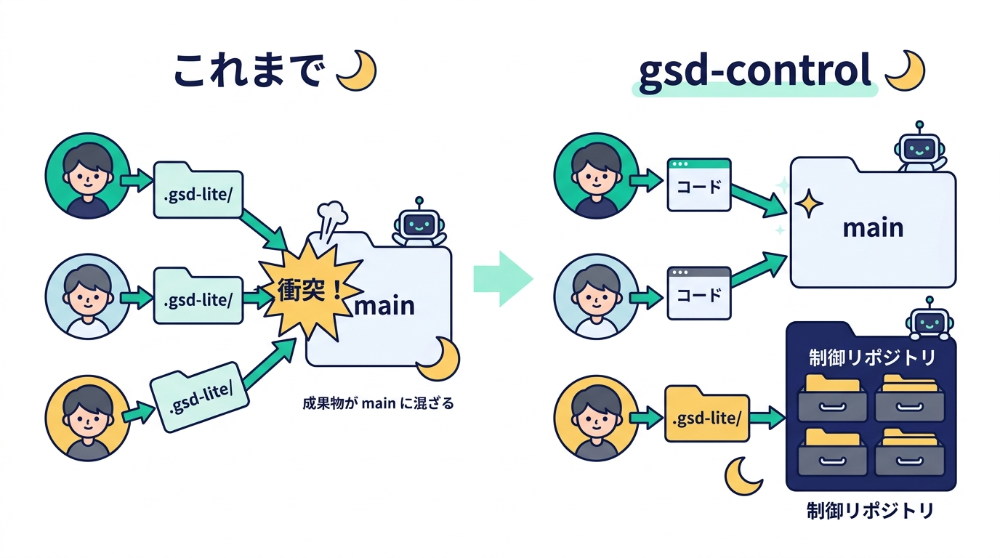

- 💥 各自の `.gsd-lite/` が main へのマージで衝突する
- 🧺 対象の main に、gsd-lite の成果物が混ざってしまう

そこで V2.5 では、**状態と成果物を別の「制御リポジトリ」に置き、対象リポジトリにはコードだけを入れる**形（gsd-control）を選べるようにしました。

### 🎚️ 抽象はたったひとつ：`target.path`

新しい設定項目は 1 つだけです。state.json の `target.path` が「コードを書く対象」を指します。

<!-- 🎨 FIG-11 | file: images/blog-v2/fig11-target-path.jpg | 16:9
PROMPT: A big friendly toggle switch (like a light switch) in the center labeled "target.path". The left position is
labeled "\".\"" with a small caption "in-repo（従来）" and an icon of a single folder containing both a code icon and a
notebook icon. The right position is labeled "\"work/<name>\"" with a caption "gsd-control" and an icon of two linked
folders: one with a notebook (control), one with a code icon (target). Under the switch a ribbon reads
"フェーズ・進捗判定・終了コードは共通". 16:9.
-->
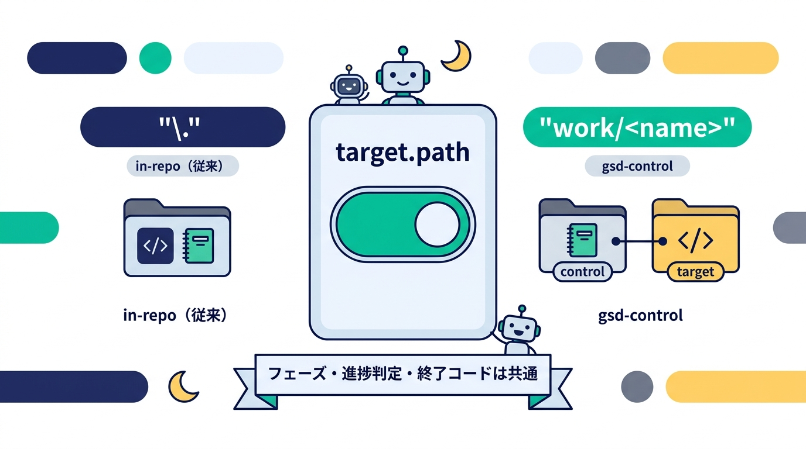

- 🏠 `"."`（キーが無い古い state も同じ扱い）→ これまでどおり、今いるリポジトリで全部やる **in-repo 形**
- 🏢 `"work/<name>"` → 制御リポジトリの下に対象を clone（gitignore）して、コードは対象側、状態と成果物は制御側に入れる **gsd-control 形**

ループのフェーズも、「コミット済みの state だけを信頼する」進捗判定も、終了コードも、両方で共通です。既存のプロジェクトは何も変えずにそのまま動きます 👍

### 🗂️ 2 つの git の役割分担

<!-- 🎨 FIG-12 | file: images/blog-v2/fig12-two-repos.jpg | 16:9
PROMPT: Two large rounded panels. Left panel (navy) titled "制御リポジトリ" showing a simple folder tree in mint
monospace text: ".gsd-lite/config.json", ".gsd-lite/milestones/<slug>/", ".claude/skills/", "work/<name>/ （git 管理外）".
Right panel (pale blue) titled "対象リポジトリ work/<name>" with icons of code files, a branch, and a merge request.
Between them two labeled arrows: top arrow from a robot in the left panel to the right panel labeled
"コード・ブランチ・MR（git -C）", bottom arrow looping back into the left panel labeled "state・成果物をコミット".
At the bottom, two small branch tags side by side, one on each panel, both reading "gsd-lite/<slug>" joined by a
ribbon labeled "同じ名前". 16:9.
-->
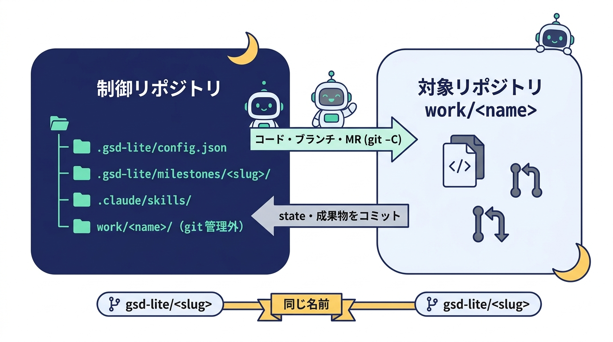

ループは制御リポジトリのルートで動きます。各ターンは、コードの変更・テスト・コミット・ブランチ・マージ・MR を `git -C work/<name>` で**対象側**に、要件・計画・進捗・検証・振り返りと state を**制御側**にコミットします。

マイルストーンは、制御側と対象側の**両方に同じ名前のブランチ** `gsd-lite/<slug>` を切ります。ループは制御側のブランチ名から、そのマイルストーンの state（`.gsd-lite/milestones/<slug>/state.json`）を見つけます。人ごと・マイルストーンごとにディレクトリが分かれるので、みんなのブランチを制御側の main に続けてマージしても衝突しません 🙆

> 🌱 **うれしい副産物：チームの「なぜ」が溜まっていく**
> 制御リポジトリの main には、マイルストーンごとの要件・決定・検証・振り返りが、コードとは別にどんどん積み上がっていきます。「この機能、なんでこう作ったんだっけ？」に答えてくれる、チームの監査証跡になるんです 📚

### 🧑‍🤝‍🧑 起動前の検証も、チーム向けに

対象が別リポジトリになると、事故のパターンも増えます。なので `--check` と通常起動で次も確かめて、違えば最初のターンの前に止まるようにしました。

- 🌿 制御ブランチ `gsd-lite/<slug>` にいること
- 📍 `target.path` が制御リポジトリ配下の相対パスで、ちゃんと存在する git リポジトリであること（無ければ clone コマンドを案内）
- 🙈 対象が制御側の git に入っていないこと（gitignore か submodule）。うっかり `git add` で対象ごと取り込む事故を防ぎます
- 👤 対象側でも git のコミット者設定があること
- 🔀 research〜verify のあいだ、対象がマイルストーンのブランチにいること（**毎ターン**確認。main に直接コミットしちゃう事故を防ぎます）

## 🕵️ 実録その 2：振り返りが見つけた「29 件の許可ルール、全部無視されてた事件」

V2.5 も実際に走らせました（2026-09-26）。制御リポジトリに小さな TODO CLI を対象として登録し、research → plan → impl ×8 → verify ×4 → ローカルマージ → reflect → DONE の 15 ターン。結果はこちらです。

<!-- 🎨 FIG-13 | file: images/blog-v2/fig13-v25-results.jpg | 16:9
PROMPT: A dark navy dashboard. Top row: four rounded stat tiles with big mint numbers and light labels:
"15" "無人ターン", "0" "リトライ", "76" "テスト green", "67 分" "ターン実行の合計".
Bottom: a horizontal timeline bar of the whole run from "13:13" to "15:34". Most of the bar is mint segments (turns),
with one long light-gray gap segment in the middle labeled "BLOCKED 待ち 79 分" and a small clock icon, and a tiny
human icon at the end of the gap labeled "1 分で判断". 16:9.
-->
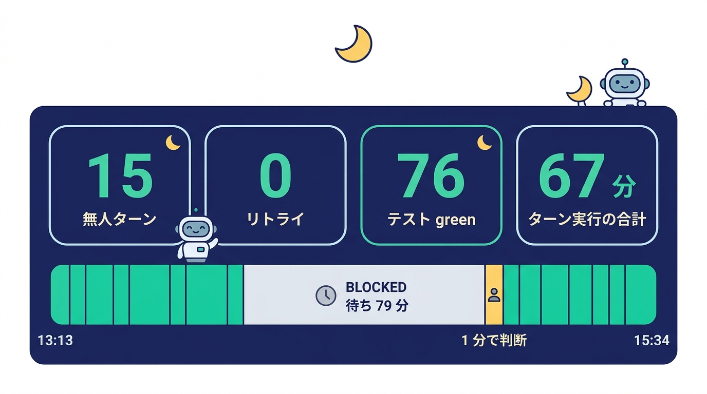

| 項目 | 値 |
|---|---|
| 🤖 無人ターン | 15（リトライ 0） |
| ✅ テスト | 76 件 green |
| ⏱️ ターン実行の合計 | 67 分 |
| ⏸️ BLOCKED | 1 回（人間待ち 79 分） |

完走はしたものの、reflect がとても鋭い振り返りを書いてくれました 👀 その中でいちばん驚いたのがこれです。

<!-- 🎨 FIG-14 | file: images/blog-v2/fig14-trust-story.jpg | 16:9
PROMPT: A comic-style single panel. A robot detective (with a small magnifying glass and a mint scarf) points at a
highlighted line on a long log scroll. The highlighted line reads "Ignoring 29 permissions.allow entries".
Around the scroll, three small crossed-out bubbles: "WebSearch ✕", "WebFetch ✕", "/tmp ✕". In the top-right corner a
speech bubble from the detective: "原因は trust でした！". Bottom caption ribbon: "振り返りが、環境の問題を見つけた".
Cheerful, 16:9.
-->
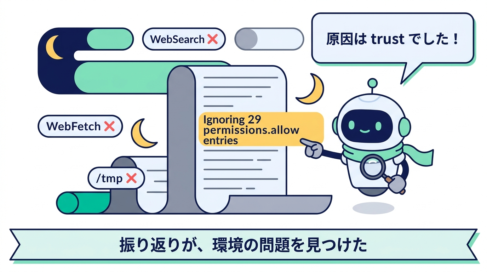

> 🔎 **本ターンのログ冒頭に「Ignoring 29 permissions.allow entries … this workspace has not been trusted」とあり、プロジェクトの許可ルール 29 件が一度も適用されていなかった可能性が高い**
> ——reflect の Minus 欄より

そうなんです。Claude Code は、そのディレクトリで「信頼する」を受け入れていないと、`claude -p` がプロジェクトの allowlist を**まるごと無視**します 😱 対話の claude を bypass モードで起動していたため、信頼の確認ダイアログが出ず、フラグが立たないまま残っていました。research の Web 検索や verify の一時ファイル書き込みが権限で弾かれていたのは、これが原因でした。

「作業の記憶を持たない reflect が、記録だけを根拠に、環境の設定ミスまで見つけてくる」——正直、ちょっと感動しました 🥹 ほかにも reflect の提案から、次のように本体を直しています。

- 🛡️ **trust の検証を `--check` に追加**：未 trust なら起動前に止めて、対処方法を表示します。`--status` にも `trust` の行が出ます
- 📍 **`--where` を追加**：Bash ツールはコール間でシェル変数を保持しないので、スキルが `MS=...` と変数に入れてから使う書き方が失敗していました（環境によってはコマンドを書き換えるフックが `$VAR` を空にすることも）。いまは最初に `gsd-lite-loop.sh --where` を 1 回呼んで、その値をリテラルのパスとして書きます
- 🔢 **`verify_round_max` の既定を 2 → 3**：軽微な指摘 1 件で上限を超え、BLOCKED のまま 79 分止まっていました。人間の判断は 1 分で済むものだったので、上限を 1 つ引き上げました
- 🧪 **verify は 1 ラウンド目で「格子」をまとめて試す**：入力経路 × 出力経路 × 例外の親クラス、をまとめて洗い、2 ラウンド目以降は回帰確認だけにします。指摘が小出しになって修正ラウンドが増えるのを防ぎます
- 📋 **plan は RESEARCH の「盗める設計」を採否表にする**：参考実装が持っていた堅牢性の設計を「最短実装」を理由に落とし、差し戻しで結局同じ設計に戻る、という遠回りがありました
- 📜 **ループのログは追記で**：再起動のたびに前回ぶんのログが消えていたので、`>>` で追記し、起動時に開始行を出すようにしました

ちなみに、1 ラウンド目の verify が見つけた指摘のひとつは「特定の不正な文字を渡すと、既存の TODO データが丸ごと消える」という**本物のデータ消失バグ**でした 😇 受け入れ基準は全部満たしていたので、verify の境界テストがなければ main に入っていたところです。堅牢性の探索そのものには価値がある、問題は「何ラウンドで打ち切るか」の設計だけ——というのが今回のいちばんの学びでした。

## 🚀 使い方：いつもの 2 コマンドは、そのままです

まずは本体を更新してインストールします。

```bash
cd ~/workspaces/gsd-lite && git pull && ./install.sh --engine all   # Claude だけなら引数なし
```

**🏠 1 人で使うなら（in-repo 形・これまでどおり）**

```
# 対象プロジェクトで claude を開いて
> /gsd-lite-init
> /gsd-lite-discuss 決済機能を追加したい
```

**🏢 チームで使うなら（gsd-control 形）**

```bash
mkdir ~/workspaces/gsd-control && cd ~/workspaces/gsd-control && claude
```

```
> /gsd-lite-init                         # 「gsd-control」を選んで、対象の URL・名前・base ブランチを答える
> /gsd-lite-discuss 決済機能を追加したい     # 制御側と対象側に gsd-lite/<slug> を切って、要件を確定
```

gsd-control 形では、ループは**制御リポジトリのルートで、制御ブランチ `gsd-lite/<slug>` にいる状態で**起動してください。それから、制御リポジトリのディレクトリでも Claude Code の「信頼する」を受け入れておきましょう（`gsd-lite-loop.sh --check` が教えてくれます）🙏

進捗の見守りは、`--status`（1 回表示）、`--watch`（簡易 TUI）、`--where`（state と成果物の場所）の 3 つで。既存のプロジェクトは、一度 `/gsd-lite-init` を実行して「スキルを最新に更新する」を選ぶと、新しいスキルに入れ替わります（進行中の `.gsd-lite/` には触りません）。

## 🔭 次に作りたいもの：Issue 駆動の分散実行（構想）

gsd-control で「ループに必要なものが、制御ブランチ 1 本にぜんぶ揃う」ようになったので、次はこんな構想を温めています 🔥

<!-- 🎨 FIG-15 | file: images/blog-v2/fig15-next-issue-driven.jpg | 16:9
PROMPT: A left-to-right flow of six rounded cards connected by mint arrows: "Issue" (with a label tag icon),
"ルータ" (a small signpost robot), "担当者の PC" (a laptop with a person, highlighted navy), "本人のサーバ"
(a small cloud server with a moon, working at night), "MR" (a merge icon), "Issue" (with a chat bubble "結果を報告").
Above the laptop a caption "discuss だけ人間", above the server a caption "あとは無人". A small dashed badge in the
corner reads "構想（未実装）". 16:9, optimistic and cheerful.
-->
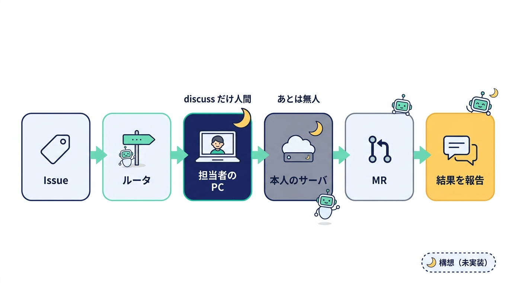

- 🏷️ Issue にラベルが付いたら、ルータが担当者を決めて、制御ブランチと要件の下書きを用意
- 💬 担当者は自分の PC で discuss だけして push
- 🌙 あとは本人のサーバのランナーがループを回して、MR を作って Issue に報告

「人間の判断は discuss に前倒し、あとは寝るだけ」を、チーム規模に広げるイメージです。実装はまだこれからですが、「ターンごとに制御側と対象側の両方を push する」「対象のツールチェーンの準備」「所有権と再開のルール」あたりから手をつける予定です。

## 🎁 まとめ

V2 と V2.5 で増えたものを並べると、けっこうな量になりました。でも、芯は前回とまったく同じです。

*新品のコンテキスト、何も考えないループ、潔く止まる勇気。そこに「記録だけを根拠に振り返る」が加わって、gsd-lite は少しずつ自分で賢くなるようになりました。*

振り返りが本体の改善につながり、その改善が次の振り返りで確かめられる——作っている本人がいちばん楽しんでいる気がします 😊

---

🌙 **今夜から試すなら** — 1 人なら対象プロジェクトで、チームなら空のディレクトリで `claude` を開いて、`/gsd-lite-init` → `/gsd-lite-discuss やりたいこと`。仕様を詰めたら、あとは寝るだけです。朝には振り返りまで書き上がっていますよ。おやすみなさい 💤

リポジトリ：[github.com/6in/gsd-lite](https://github.com/6in/gsd-lite)（README に各機能の使い方、docs/SPEC.md に設計、docs/gsd-lite-concept-v2.pptx に V2 / V2.5 の説明資料があります）
